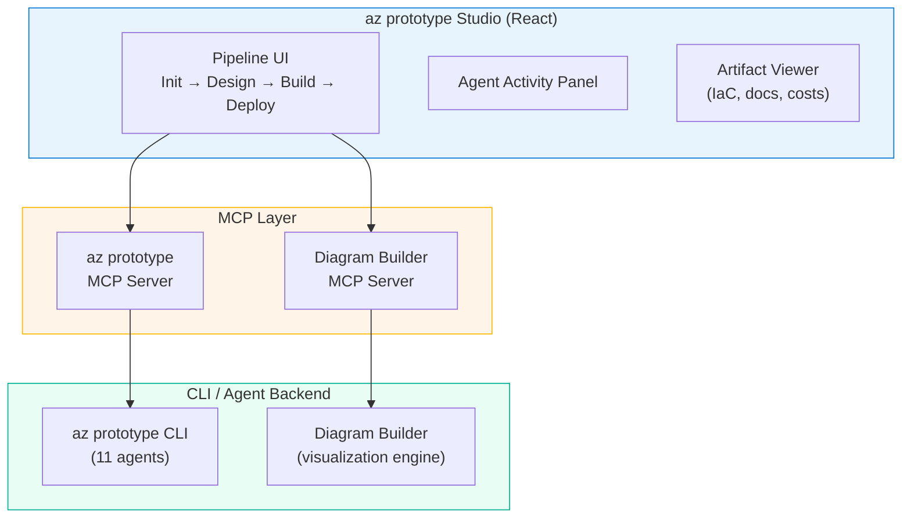

This is a great question. I noticed your diagram builder already has a "bidirectional az prototype integration (export + import)" commit from a few hours ago, so you're already connecting the two tools. Let me lay out what I think makes sense.

## The Opportunity

`az prototype` is powerful but its entire experience is terminal-based. For PSA partner engagements, that works for technical audiences, but business stakeholders, IT leaders, and architects who aren't CLI-comfortable miss the impact. A visual layer would make the difference between "let me show you this terminal output" and "let me walk you through your architecture."

## Three Approaches (with my recommendation)

### Option 1: Extend Your Diagram Builder (Lowest effort, fastest ROI)

You already have a mature React/TypeScript app with React Flow, WAF validation, cost estimation, Bicep generation, and now an MCP server. The bidirectional integration you just committed means the diagram builder can already consume `az prototype` design output and feed architecture back in.

What you'd add:

* An "az prototype" panel/mode that orchestrates the 4-stage pipeline visually
* The design stage maps naturally to what the diagram builder already does (generate architecture from natural language)
* Build output (Terraform/Bicep) visualized as a staged deployment plan
* Deploy status rendered as a live dashboard within the existing app

**Pros:** You reuse 90% of existing code. Partners already see the diagram builder as compelling. You just layer the prototype pipeline on top.

**Cons:** The diagram builder's scope grows. Two missions in one app can get complex.

### Option 2: Build a Dedicated "az prototype Studio" (Purpose-built, highest impact)

A standalone web app, built in React/TypeScript (same stack), focused entirely on the 4-stage pipeline with rich visualization at every step.

Conceptual layout:

```text
┌─────────────────────────────────────────────────────────┐
│  az prototype Studio                                    │
├──────────┬──────────────────────────────────────────────┤
│          │                                              │
│  Stages  │   Main Canvas                                │
│          │                                              │
│  ● Init  │   [Architecture Diagram / Build Plan /       │
│  ● Design│    Deploy Dashboard — depends on stage]      │
│  ● Build │                                              │
│  ● Deploy│                                              │
│          │                                              │
├──────────┤──────────────────────────────────────────────┤
│  Agents  │   Agent Activity / Conversation Feed         │
│  Panel   │   (shows which agent is active, what it's    │
│          │    doing, token usage in real-time)           │
└──────────┴──────────────────────────────────────────────┘
```

Key screens per stage:

| Stage | Visual Experience |
|---|---|
| Init | Project config wizard (naming strategy preview, template selection with architecture thumbnails, provider setup) |
| Design | Split view: conversation with biz-analyst on left, live architecture diagram building on right (embed diagram builder via iframe or shared components). Scope tracker showing in-scope/out-of-scope/deferred items |
| Build | Deployment stage map (think GitHub Actions visual). Each stage as a card showing files generated, policies enforced, anti-patterns caught. Expandable code previews |
| Deploy | Real-time status per stage with preflight checks as a checklist, live terraform plan output, rollback controls. Post-deploy: captured outputs, cost analysis, generated docs |

**Pros:** Purpose-built UX. Clean separation of concerns. Can embed the diagram builder for the architecture visualization piece. Strong demo story: "Here's the studio where you design, build, and deploy."

**Cons:** More upfront work. New codebase to maintain.

### Option 3: Hybrid, MCP-First Architecture (My recommendation)

Build "az prototype Studio" as a lightweight React app, but use the MCP server pattern you've already proven in the diagram builder. The architecture:



Why MCP-first:

* You already have the diagram builder MCP server working with Claude Desktop (your screenshot)
* You'd create an `az prototype` MCP server that exposes `init`, `design`, `build`, `deploy`, `status`, `analyze` as tools
* The Studio UI calls both MCP servers: prototype server for pipeline orchestration, diagram builder server for visualization
* Claude Desktop, GitHub Copilot, or any MCP client can also invoke the same tools (headless or visual)
* Partners who want the CLI keep the CLI. Partners who want the visual get the Studio. Same backend.

The `az prototype` MCP server tool surface would map naturally:

| MCP Tool | Maps To | Returns |
|---|---|---|
| `prototype_init` | `az prototype init` | Project config YAML |
| `prototype_design` | `az prototype design` | Architecture JSON (feed to diagram builder) |
| `prototype_build` | `az prototype build` | Stage plan with file listing |
| `prototype_deploy_plan` | `az prototype deploy --dry-run` | What-if output |
| `prototype_deploy_stage` | `az prototype deploy --stage N` | Deployment result |
| `prototype_status` | `az prototype status --json` | Full pipeline state |
| `prototype_analyze_costs` | `az prototype analyze costs --output-format json` | Cost breakdown |
| `prototype_analyze_error` | `az prototype analyze error` | Root cause + fix |

## My Recommendation

Go with **Option 3** for these reasons:

1. **You've already proven the MCP pattern.** Your diagram builder MCP server works. Doing the same for `az prototype` is the natural next step.

2. **Two tools, one story.** In a partner briefing: "I'll design the architecture visually in the diagram builder, export it to az prototype for governance-compliant IaC and deployment, and monitor everything in the Studio." That's a cohesive narrative.

3. **Incremental build path.** You don't need the full Studio on day one. Start with the `az prototype` MCP server. Then you can build Studio screens one at a time (start with the deploy dashboard since it's the most visually impactful). The MCP server is useful immediately with Claude Desktop and GitHub Copilot even before the Studio exists.

4. **PSA demo flow becomes:** Natural language prompt in diagram builder → validate against WAF → export to az prototype → build compliant IaC → deploy with live dashboard → show cost analysis. All visual. All Azure-native.

## Suggested Next Steps

1. **Create the az prototype MCP server** (Python, wraps the CLI commands with JSON output)
2. **Test it with Claude Desktop** alongside your diagram builder MCP server
3. **Build the Studio UI incrementally**, starting with the deploy status dashboard and cost analysis views (these are the most visually impressive for partners)
4. **Update the PSA enablement guide** with a "Visual Mode" use case section

Want me to start scaffolding the MCP server for `az prototype` in this repo, or would you prefer to think on it a bit more first?