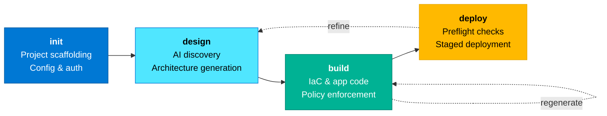
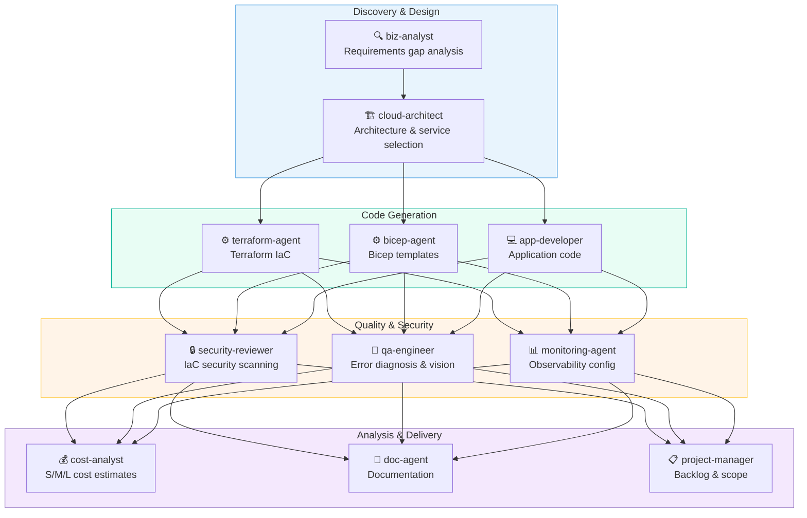
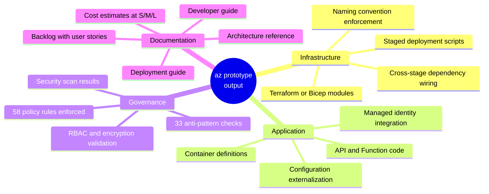
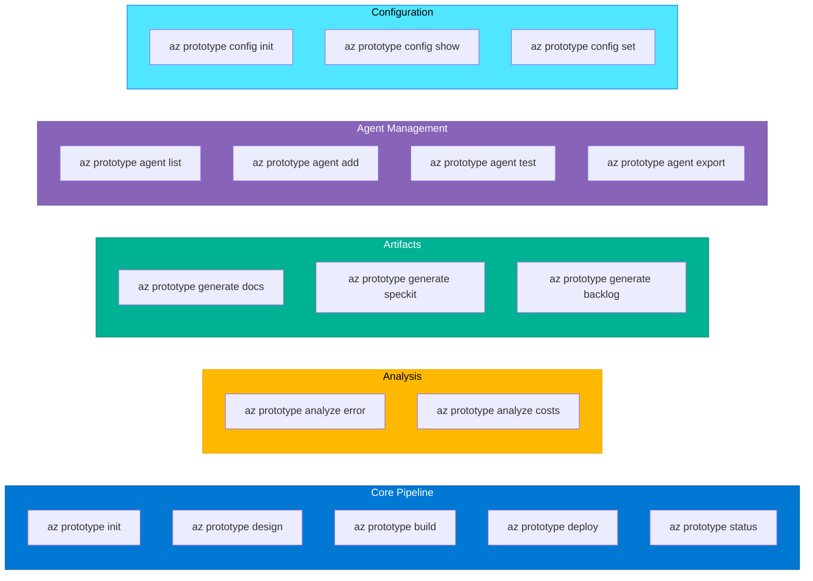

# az-prototype experimentation workspace

A hands-on lab for exploring, testing, and demonstrating [`az prototype`](https://github.com/Azure/az-prototype), the Azure CLI extension that turns ideas into deployed Azure prototypes using AI-driven agent teams.

> Built for Partner Solution Architects (PSAs) who want to accelerate partner engagements with rapid Azure prototyping powered by GitHub Copilot.

## How az prototype Works

The tool condenses the Innovation Factory's 12-stage methodology into four re-entrant commands. Each stage can be revisited to refine architecture or regenerate code without starting over.



## Multi-Agent Architecture

Eleven specialized agents collaborate across the pipeline, each handling a distinct aspect of prototype generation.



## What Gets Generated

A single run through the pipeline produces a complete set of production-ready artifacts.



## Getting Started

### Prerequisites

| Requirement | Details |
|---|---|
| Azure CLI 2.50+ | `az --version` to confirm |
| Azure subscription | With deployment permissions |
| GitHub CLI (`gh`) | Installed and authenticated |
| GitHub Copilot license | Business or Enterprise |
| Terraform or Bicep | Your preferred IaC tool |

### Setup

```bash
# Clone this repo
git clone https://github.com/Arturo-Quiroga-MSFT/az-prototype-lab.git
cd az-prototype-lab

# Create and activate the virtual environment
uv venv
source .venv/bin/activate

# Install the az prototype extension
az extension add --name prototype
```

### Quick Start

```bash
# Initialize a new prototype project
az prototype init --name my-poc --location eastus

# Run interactive design (AI agents ask clarifying questions)
az prototype design

# Generate infrastructure and application code
az prototype build

# Deploy to Azure with preflight checks
az prototype deploy
```

## Guides

| Guide | Description |
|---|---|
| [PSA Enablement Guide](guides/psa-enablement-guide.md) | 12 use cases for Partner Solution Architects, from live demos to custom agent workshops. Covers technology briefings, Architecture Design Sessions, PoCs, CI/CD integration, and more. |

## Command Reference (Quick View)



## Resources

| Resource | Link |
|---|---|
| az prototype repo | [github.com/Azure/az-prototype](https://github.com/Azure/az-prototype) |
| Feature reference | [FEATURES.md](https://github.com/Azure/az-prototype/blob/main/FEATURES.md) |
| Command reference | [COMMANDS.md](https://github.com/Azure/az-prototype/blob/main/COMMANDS.md) |
| Wiki | [github.com/Azure/az-prototype/wiki](https://github.com/Azure/az-prototype/wiki) |
| Issues and bugs | [github.com/Azure/az-prototype/issues](https://github.com/Azure/az-prototype/issues) |
